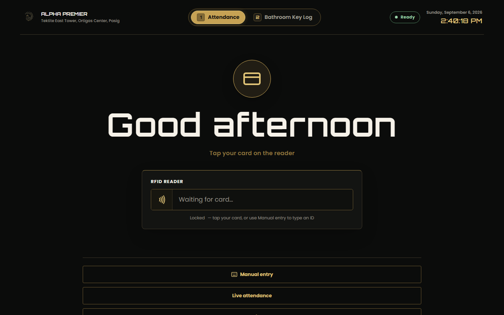
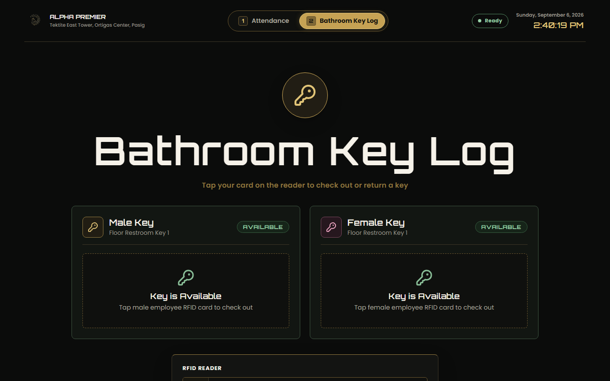
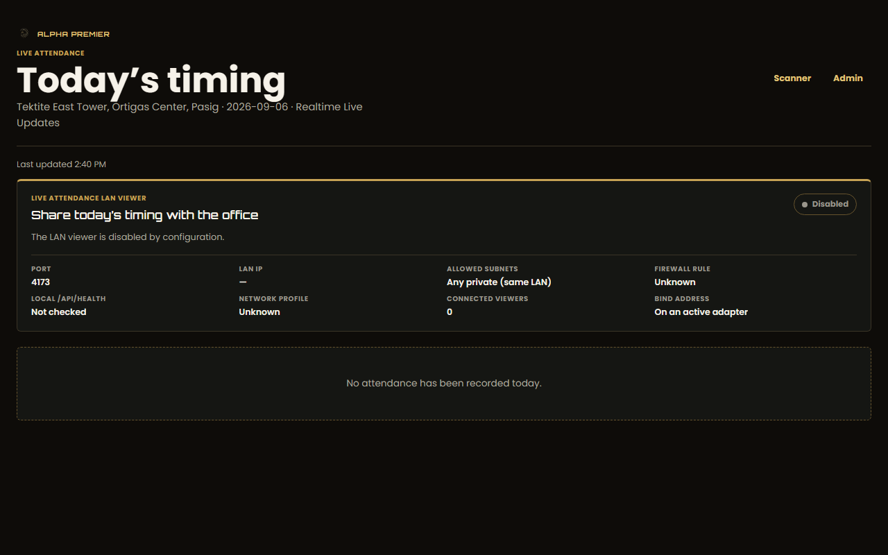
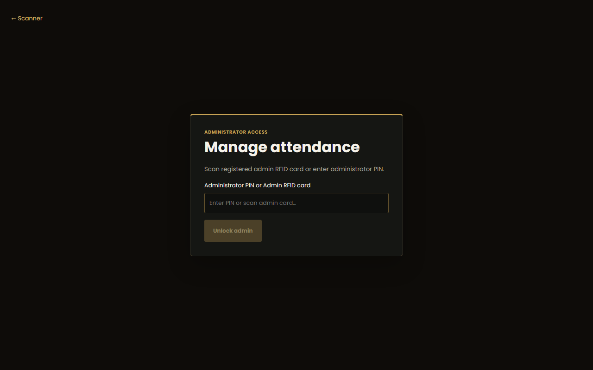

<p align="center">
  
</p>

<h1 align="center">Alpha Premier Attendance</h1>

<p align="center">
  <strong>Windows-first RFID attendance kiosk for the front desk.</strong><br />
  Tap a card. See the photo. Done in under a second.
</p>

<p align="center">
  
  
  
  
</p>

<p align="center">
  <a href="#download">Download</a> ·
  <a href="#features">Features</a> ·
  <a href="#kiosk">Kiosk</a> ·
  <a href="#payroll">Payroll</a> ·
  <a href="#lan-viewer">LAN viewer</a> ·
  <a href="#tech-stack">Stack</a> ·
  <a href="#development">Development</a>
</p>

<p align="center">
  
</p>

<p align="center">
  <em>The front-desk kiosk at rest — card tap drives the whole flow. Below: bathroom key mode, live viewer, and admin unlock.</em>
</p>

<p align="center">
  
</p>

---

## What is Alpha Premier Attendance?

Paper logbooks and generic HR tools assume someone is watching the door. This app **is** the watcher: a Tauri v2 desktop app on the front-desk Windows laptop, the only machine connected to the RFID reader and the only attendance writer. It stores everything in local SQLite and exposes a read-only live dashboard to the office LAN.

| Approach | Needs watcher | Works offline | Per-tap proof | Payroll-ready |
| --- | --- | --- | --- | --- |
| Paper logbook / Sheets | Yes | Yes | No | Manual |
| Generic cloud HR | Yes | No | Sometimes | Varies |
| **Alpha Premier Attendance** | **No — kiosk is always on** | **Yes, SQLite-first** | **Photo + audit trail** | **One-click PDF per cutoff** |

- **Offline-first kiosk** — SQLite is the source of truth; Google Sheets is an optional write-only export, never required for a scan.
- **Sub-second tap flow** — native-layer capture, photo feedback, duplicate cooldown.
- **Office rules built in** — 8:00–17:00 hours, grace, late-timeout, unpaid lunch.
- **Boss-friendly live view** — read-only browser dashboard over the office Wi-Fi, no install.
- **Audit-ready payroll** — semi-monthly cutoffs, one consolidated PDF per worker type.

## Download

| Platform | Download |
| --- | --- |
| Windows 10/11 x64 | [Setup.exe on GitHub Releases](https://github.com/Deign86/alpha-premier-attendance/releases) |

> The NSIS package bundles the WebView2 bootstrapper and installs machine-wide (admin approval required). The portable `.exe` needs WebView2 already installed — prefer the NSIS package for fresh machines.
>
> Pushing a `v*` tag builds and signs release bundles in CI (`.github/workflows/release.yml`).

## Features

<p align="center">
  
</p>

### Kiosk

The `/` route is the always-on front screen. Mode tabs switch the workflow — press `1` for attendance, `2` for bathroom keys (keypresses are ignored while typing in inputs).

| Mode | What happens on tap |
| --- | --- |
| **Attendance** | Time-in/out recorded, employee photo shown, duplicate taps cooled down |
| **Bathroom Key Log** | Male/Female key checked out to the tapper with a live elapsed timer, or returned with duration logged |

Scanner feedback stays on the kiosk (processing, success + photo, unknown card, duplicate cooldown, error). Diagnostics live in admin/setup — never on the main screen. Closing the window hides the app to the tray; scanning keeps running. A scan while hidden shows a Windows toast without stealing focus.

### RFID and readers

| Reader | Transport | Capture |
| --- | --- | --- |
| 125 kHz EM4100 USB (default) | Keyboard wedge: 10 decimal digits + Enter, burst under 100 ms | Foreground only (kiosk focused), heuristic classification |

The Rust layer completes a scan on the Enter suffix or idle-timeout fallback, normalizes the UID to uppercase hex, validates length, and dedupes repeats in a short window. The scanner listener pauses while the operator types in admin, setup, or manual-entry screens. The admin Scanner panel shows read-only keyboard-wedge status (mode, expected length, detail).

### Attendance rules

| Rule | Value |
| --- | --- |
| Office hours | 08:00–17:00, `Asia/Manila` |
| Late grace | Arrival after 08:15 is late; grace usable at most once per user per week |
| Late time-out | Time-out at or after 18:00 is saved as `LATE_TIMEOUT` — kept and flagged, no payroll row until the official time-out is re-entered before 18:00 |
| Lunch | 12:00–13:00 fixed window is unpaid — subtracted from worked hours, the `TOTAL_HOURS` workbook column, and overtime inputs (intern lateness still measured from 08:00) |
| Intern rate | PHP 80.00/day, PHP 10.00/hour late deduction after weekly grace |

### Admin

`/admin` unlocks with the administrator PIN or a registered admin RFID card into a short-lived session. Tabs: **users** (roster + card binding), **attendance** (editor, exports), **payroll** (cutoff workspace), **data** (backup/restore, LAN viewer, updater), **voice** (TTS settings).

<p align="center">
  
</p>

### Payroll

The Payroll tab has exactly two generate actions — **Generate Employee Payroll PDF** and **Generate Intern Payroll PDF**. Each produces one consolidated landscape sheet (printpdf, no browser print) with the reference columns, company/cutoff header, and a highlighted Gross Compensation grand total. Files land timestamped in the exports folder, are recorded in the `payroll_pdfs` table (period, worker type, headcount, total, SHA-256, size), and listed with **Open PDF** / **Show in Folder**.

Cutoff payroll supports semi-monthly profiles, allowances, incentives, manual adjustments, finalization, and a fillable late-deduction section (total late hours × PHP-per-hour rate, overridable). Interns appear on the intern sheet at the fixed daily rate.

### Bathroom key log

A parallel mode digitizing the handwritten restroom-key logbook: exactly one physical key per gender (`MALE`/`FEMALE`), enforced by a partial unique index plus backend validation so a checked-out key cannot be double-issued. Live elapsed timer, searchable employee picker, and a chronological log with date filter, timestamps, duration, and `OUT`/`RETURNED` status (pictured above).

### LAN viewer

The front-desk laptop serves a read-only dashboard to the office network. The boss opens the printed LAN URL from any browser — no Tauri install.

| Route | Purpose |
| --- | --- |
| `GET /attendance` | Read-only browser dashboard |
| `GET /api/attendance/today?date=YYYY-MM-DD` | Manila-date snapshot |
| `GET /api/events/attendance` | SSE stream (polling fallback) |
| `GET /api/health` | Service, SQLite, LAN, and export health |

Admin, payroll, setup, photo, and mutation APIs stay local to the Tauri app. If phones hang on "Connecting…", allow port 4173 in Windows Firewall as Administrator:

```powershell
netsh advfirewall firewall add rule name="Alpha Premier Live Attendance" dir=in action=allow protocol=TCP localport=4173
```

See [docs/lan-dashboard-deployment.md](docs/lan-dashboard-deployment.md) and [docs/lan-dashboard-troubleshooting.md](docs/lan-dashboard-troubleshooting.md).

## Install and run

```powershell
npm install
npm run dev        # web stack: API on :3001 + Vite on :5173
npm run tauri:dev  # desktop app (builds client first)
```

Kiosk routes: `/` scan · `/attendance` local view · `/admin` protected admin.

### Front-desk configuration

```powershell
Copy-Item src-tauri/config.example.toml "$env:APPDATA\com.alphapremier.attendance\config.toml"
```

```toml
[lan]
enabled = true
port = 4173
allowed_subnets = ["192.168.1.0/24"]
auth_mode = "password"
viewer_password_hash = "<sha256-hex-token-hash>"

[office]
company_name = "Alpha Premier"
office_display_full = "Unit 3104C, Tektite East Tower, Ortigas Center, Pasig, Metro Manila"
```

Leave `bind_address` unset to auto-detect the office Wi-Fi IP. Secrets stay on the laptop and are never committed. Office identity defaults to the real Tektite East Tower address even with no config file. Full reference: [docs/deployment.md](docs/deployment.md), [docs/google-sheets-setup.md](docs/google-sheets-setup.md).

### Windows packaging

```powershell
npm run tauri:build
```

```text
src-tauri/target/release/alpha-premier-attendance.exe
src-tauri/target/release/bundle/nsis/Alpha Premier Attendance_0.1.51_x64-setup.exe
```

## Generated files and portable mode

Everything the app creates (attendance/payroll workbooks, CSVs, payslips, register PDFs) goes to the exports folder, and the UI shows the exact path with `Open file` / `Show in folder`.

| Mode | Location |
| --- | --- |
| Installed (default) | `%LOCALAPPDATA%\com.alphapremier.attendance\exports\` |
| Portable (`portable.dat` next to the `.exe`, or `ALPHA_PREMIER_PORTABLE=1`) | `Data\exports\`, `Data\attendance.db` next to the executable |

Photos live under the data dir as `{user_id}.webp` (JPEG/PNG/WebP input, 512×512 max, 500 KB) and are never served over LAN. File actions require an admin session and only accept paths inside the data root.

## Self-updating

Powered by the Tauri v2 updater against signed `minisign` artifacts on GitHub Releases: silent background checks every 8 hours, manual check via tray menu or Admin → Data and backup, per-terminal opt-out in Admin settings or `ALPHA_PREMIER_DISABLE_AUTO_UPDATE=1`. Keypair setup: [docs/UPDATES.md](docs/UPDATES.md).

## Data migration and moving PCs

```powershell
npm run migrate:from-sheets -- --dry-run --input .\sheets-export
npm run migrate:from-sheets -- --execute --input .\sheets-export --db .\attendance.db
```

The database is one file — move machines via **Admin → Data and backup**: create backup on the old PC, copy the `.apbackup` archive (database, photos, exports, sync state, config), restore on the new PC. Never copy `attendance.db` while the app is open. Details: [docs/database-migration.md](docs/database-migration.md), [docs/migration-cutover.md](docs/migration-cutover.md), [docs/payroll-operations.md](docs/payroll-operations.md).

## Tech stack

| Layer | Technology |
| --- | --- |
| Desktop shell | Tauri v2 (`com.alphapremier.attendance`), system tray, updater, opener |
| Frontend | React 19 + TypeScript + Vite (`client/`) |
| Store | SQLite via SQLx, WAL mode, numbered migrations (`src-tauri/db/migrations`) |
| LAN server | Axum + SSE on port 4173 (read-only) |
| Export | Async Google Sheets queue (optional, write-only) + printpdf payroll PDFs |
| Voice | Piper/ONNX TTS with cloned voices (`scripts/generate_cloned_voices.py`) |
| Contracts | Shared TS API/LAN/office-hours rules (`shared/`) mirrored in Rust |
| Automation | Tauri MCP bridge (`ws://127.0.0.1:9223`) — `doctor:mcp` / `verify:mcp` |

<p align="center">
  
</p>

<p align="center">
  <em>Native screenshot captured through the live Tauri MCP bridge during automated verification.</em>
</p>

## Roadmap

| Feature | Description |
| --- | --- |
| Signed auto-update rollout | Promote updater artifacts to the front-desk fleet |
| Sheets reconciliation UI | Surface export queue health in the Data tab |
| Multi-terminal roster sync | Keep single-writer SQLite, share snapshots |
| Self-enrollment kiosk flow | Assisted card binding without admin help |

## Development

```powershell
npm run build       # shared + client + server
npm run typecheck   # shared, client, server
npm run lint        # eslint workspaces + oxlint
npm test            # vitest: shared, client, server
npm run rust:check
npm run rust:test
node scripts/doctor-tauri-mcp.mjs   # Tauri bridge pre-flight
node scripts/verify-tauri-mcp.mjs   # drives kiosk/admin/payroll via bridge
node scripts/capture-readme-screenshots.mjs  # refresh docs/screenshots/
```

```text
client/       React, Vite, TypeScript kiosk and admin UI
server/       Web API retained for compatibility and comparison
shared/       Shared TypeScript API and LAN contracts
src-tauri/    Tauri v2 app, Rust commands, services, SQLite, LAN server
docs/         Deployment, hardware, payroll, migration guides
docs/screenshots/  README screenshots captured from the running app
scripts/      Dev, migration, voice, and screenshot helpers
evidence/     Automated verification output + native screenshots
```

## Contributing

1. Fork and create a feature branch.
2. Keep the diff minimal — reuse existing helpers and patterns.
3. Run `npm run typecheck`, `npm run lint:oxlint`, `npm test`.
4. Open a PR describing behavior change and verification.

## Security

Admin/PIN sessions are short-lived in-memory Tauri state. PINs, token hashes, and Google credentials never leave the front-desk laptop; the LAN viewer is read-only and subnet-restricted. Report vulnerabilities privately to the repository owner.

## License

MIT — see [LICENSE](LICENSE).

<p align="center">
  <a href="https://github.com/Deign86/alpha-premier-attendance">Deign86/alpha-premier-attendance</a>
</p>
