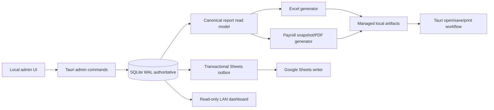
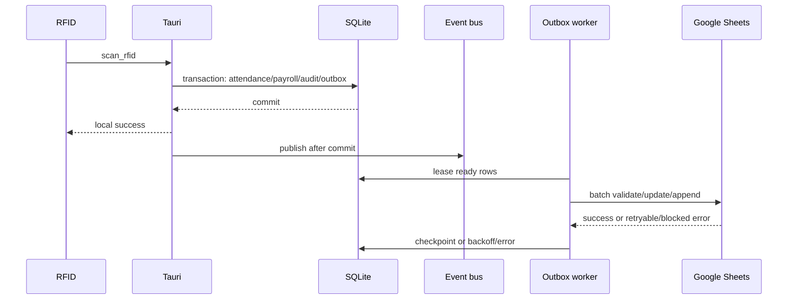

# Attendance Exports and Payroll Documents Implementation Plan

> **For agentic workers:** Use `superpowers:subagent-driven-development` or `superpowers:executing-plans` to implement this plan task by task. Preserve the existing Tauri/SQLite architecture and keep the test suite green after every phase.

**Goal:** Add reliable Excel workbooks, optional idempotent Google Sheets projections, and professional payroll PDFs while SQLite remains the only source of truth.

**Architecture:** Tauri commands read a stable SQLite snapshot into canonical Rust DTOs. Excel and PDF artifacts are generated locally after the read transaction closes. Google Sheets receives committed local outbox rows asynchronously and never participates in attendance or payroll transactions.

**Tech Stack:** Tauri v2, Rust 1.88, SQLx/SQLite WAL, React/Vite/TypeScript, `rust_xlsxwriter`, `printpdf`, Google Sheets API v4, `Asia/Manila`, Windows NSIS.

---

## 1. Executive Summary

Build three local-admin capabilities:

- Downloadable `.xlsx` attendance, daily-register, payroll-register, payslip, audit, and optional master workbooks.
- Correctly ordered, typed, formatted, retryable, deduplicated Google Sheets projections for `Users`, `Attendance`, `AuditLogs`, `InternGrace`, `Payroll`, `PayrollProfiles`, and `PayrollCutoffs`.
- A4 payslip, management-register, and optional cutoff-cover PDFs with visible DRAFT, FINALIZED, and VOID states.

SQLite remains authoritative. Attendance, payroll, audit, and outbox writes commit before event publication or external I/O. Google failure, PDF failure, disk failure, LAN failure, or printer failure must never make RFID scanning depend on an external service.

Non-goals: cloud database migration; public file/API exposure; LAN mutation/admin/file routes; Google Sheets as an attendance write dependency; cloud PDF APIs; statutory deductions not already implemented; and invention of employee late rules while `src-tauri/src/services/employee_payroll.rs` marks them TBD.

## 2. Current-System Assessment

Verified current paths and symbols:

| Area | Existing implementation |
| --- | --- |
| Tauri startup/state | `src-tauri/src/lib.rs:423` `run`; `src-tauri/src/state.rs` `AppState::new` |
| SQLite migrations | `src-tauri/db/migrations/0001_core.sql`, `0002_sync_queue.sql`, `0003_seed_profiles.sql` |
| Core entities | `users`, `attendance`, `audit_logs`, `intern_grace`, `payroll`, `payroll_profiles`, `payroll_cutoffs` |
| Attendance writer | `src-tauri/src/lib.rs:304` `scan_rfid` |
| Payroll services | `services/intern_payroll.rs`, `employee_payroll.rs`, `cutoff_payroll.rs` |
| Payroll commands | `payroll_list_profiles`, `payroll_create_cutoff`, `payroll_update_cutoff`, `payroll_finalize_cutoff`, `payroll_export_csv` in `src-tauri/src/lib.rs:143-218` |
| Existing queue | `src-tauri/src/lib.rs:297` `enqueue_sync`; `src-tauri/src/services/sheets_sync.rs` |
| Existing Sheets config | `src-tauri/src/config.rs` `LanConfig`; legacy values under `[lan]` in `src-tauri/config.example.toml` |
| Legacy Sheets contract | `server/src/sheets.ts` `requiredHeaders`, `GoogleSheetsAdapter`; setup documented in `docs/google-sheets-setup.md` |
| Sheets migration | `src-tauri/src/bin/migrate_from_sheets.rs` |
| LAN boundary | `src-tauri/src/lan_server.rs` exposes only read-only attendance/health/SSE routes |
| Admin UI | `client/src/App.tsx:585` `AdminPanel`, `PayrollWorkspace`, `PayrollTable` |
| Native bridge | `client/src/tauri-api.ts`, `client/src/api.ts` |
| Shared contracts | `shared/src/api-contracts.ts:117-174` payroll types |
| CSV | Rust `payroll_export_csv`; legacy HTTP export at `server/src/app.ts:107` |
| Tests | 35 JS/TS tests and 8 Rust tests currently pass |

Important verified gaps to fix:

- The Tauri scan path uses separate SQL statements; transactionally group attendance/payroll/audit/outbox and publish events only after commit.
- `enqueue_sync` currently ignores insertion errors.
- `sheets_sync.rs` writes one attendance-shaped row for every table and has no schema/version/idempotency/formatting/batch layer.
- Retry is capped at five attempts with generic errors and no leases.
- No Excel/PDF artifact service, snapshot table, generated-file metadata, or export history exists.
- The current payroll UI still links to HTTP CSV and calls `window.print()`.

`NEW COMPONENT REQUIRED`: canonical report DTOs/query layer; export jobs/artifacts; finalized payroll snapshots; Excel generator; PDF renderer/templates; versioned Sheets writer; admin export history/actions; migrations `0004+`.

## 3. Architecture Principles

- SQLite WAL is authoritative; reports read from a short transaction-safe snapshot.
- Payroll finalization creates an immutable canonical snapshot/hash. Final exports use that snapshot; draft exports read current draft data and show DRAFT.
- All dates, week boundaries, cutoffs, and labels use `Asia/Manila`.
- Money is `i64` centavos internally and `PHP #,##0.00` at presentation boundaries.
- External Sheets writes are a retryable projection, never a transaction participant.
- Local files are generated under a managed export root using temp-file plus atomic rename.
- No artifact, log, UI error, LAN response, or source file contains credentials, PINs, tokens, spreadsheet IDs, local paths, or session data.
- The LAN dashboard stays read-only and receives no payroll/export capability.

## 4. Canonical Data Contract

Create `src-tauri/src/reporting/models.rs`, `queries.rs`, and matching additions in `shared/src/api-contracts.ts`.

Canonical records:

- `ExportUser`: stable user ID, RFID UID, historical/current name, department, status, employee type, rate/profile IDs, revision, created/updated timestamps.
- `ExportAttendanceRecord`: attendance ID/date, user ID, denormalized historical name, raw RFC3339 time-in/out, status/source/notes, revision, current-user state.
- `AttendanceDailySummary`: date, counts by status, total computed hours.
- `ExportPayrollProfile`: profile values from `payroll_profiles` without recalculation.
- `ExportPayrollCutoff`: every stored `payroll_cutoffs` input/output, employee/profile identity snapshot, status, revision, finalization/void fields, snapshot hash.
- `PayrollLineItem`, `AllowanceItem`, `IncentiveItem`, `ManualAdjustmentItem`, and `GraceLateItem`: deterministic display decomposition of existing stored columns.
- `PayrollTotals`: all totals in centavos.
- `ExportOperation`, `GeneratedArtifact`, and `SheetProjectionEvent`: job status, artifact metadata, idempotency, hash, safe errors.

Rules: dates `YYYY-MM-DD`; raw timestamps retain offsets; display values are Manila-local; optional values are `null`; sort by date/time/name/ID; missing current users remain historical; finalized records never re-read mutable user/profile fields. Report code must not call payroll calculators or invent employee late rules.

## 5. Excel Design

Use `rust_xlsxwriter` pinned to `0.97.0`, with `chrono` and `constant_memory`. Pin Rust to 1.88 because that crate version requires it. It supports tables, formatting, formulas, page setup, filters, freeze panes, conditional formatting, validation, and printer settings, but writes new workbooks only, which is acceptable for reproducible reports.

Default folder: `Documents\\Alpha Premier Attendance\\Exports\\YYYY\\MM`; fallback to app-local data. Use sanitized IDs, never employee names, in filenames. Write a random same-directory temp file, flush, hash, and atomically rename.

Common style: title/metadata block, readable wrapped headers, frozen header/ID columns, Excel tables/autofilters, static audited totals, Manila display dates/times, PHP currency format, A4 print area, repeating headers, fit-to-width, page numbers, generated timestamp, app version, job/document ID. Status is always text; colors are supplemental. Draft/void bands repeat in print headers.

Workbook types:

1. Attendance range: `Attendance`, `Daily Summary`, `Report Info`. Columns: Employee ID, Employee Name, Department, Date, Time In, Time Out, Total Hours, Status, Source, Notes. Landscape A4.
2. Daily register: `Daily Register`, one Manila date, same operational columns, summary counts, landscape A4.
3. Payroll register: `Payroll Register`, `Line Item Detail`, `Report Info`. Columns: Employee ID, Employee Name, Position/Profile, Cutoff Period, Working Days, Basic Pay, Holiday Pay, Allowances, Incentives, Overtime Pay, Late Deductions, Half-Day Deductions, Absence Deductions, Manual Adjustment, Gross Compensation, Net Pay, Payroll Status, Document ID. Landscape A4.
4. Individual payslip workbook: `Payslip`, `Calculation Detail`, `Report Info`; portrait A4 and no employee photo by default.
5. Audit/export history workbook: safe job metadata only, no secrets or payloads.
6. Optional master workbook: Users, Attendance, Daily Summary, Payroll Register, Export History, Report Info; payroll inclusion requires confirmation.

Detail values and totals are static values from SQLite/snapshot data. Do not embed payroll formulas. Formula-like text is written as explicit strings.

## 6. Google Sheets Design

Add `[google_sheets]` configuration while accepting existing `[lan]` service-account/spreadsheet keys as compatibility aliases. Missing/invalid configuration disables syncing only. Credentials remain local and direct service-account access is write-only.

Managed tabs and semantics:

| Tab | Semantics |
| --- | --- |
| Users | Latest-state projection; deleted rows become `record_state=DELETED` |
| Attendance | Latest-state projection with raw ISO and formatted display columns |
| AuditLogs | Append-only |
| InternGrace | State projection plus audit history |
| Payroll | Latest-state daily ledger |
| PayrollProfiles | Latest-state projection |
| PayrollCutoffs | Latest-state draft/final/void management register |
| `_SyncEvents` | Hidden/protected append-only change/idempotency history |
| `_ExportMeta` | Hidden/protected schema/header metadata |

Version 2 headers must be defined as constants in `services/sheets_sync/schema.rs` and validated in stable order. Preserve the seven legacy tabs and provide an explicit admin migration that backs up old tabs before conversion. Manually renamed tabs, changed headers, duplicate stable IDs, or inaccessible spreadsheets fail closed for that tab.

Use stable row IDs and idempotency keys `v2:<entity>:<row-id>:<operation>:<revision>:<payload-hash>`. Update exactly one matching row; append only when missing; never guess among duplicates. Finalized payroll values are immutable; corrections use void plus replacement. Use batchGet/batchUpdate/append APIs, one validation pass per connection/schema version, row leases, bounded exponential backoff, `Retry-After`, and persistent attempt/error state. Retry network/408/429/5xx, refresh one 401, and block auth/schema/permission failures.

## 7. Payroll PDF Design

Primary renderer: `printpdf` `0.12.5` with a constrained XHTML/table layout, embedded licensed font, A4 page helpers, and PDF status overlays. It is offline and Rust-native. Fallback: a pinned bundled Typst CLI sidecar if objective golden tests fail for pagination, Unicode, or typography. Frontend printing is preview/manual-print only, not the official artifact path.

Payslip PDF: A4 portrait; company header; employee/profile; cutoff/status/document ID; attendance summary; earnings; deductions; gross/net emphasis; optional signature lines; generated time; confidentiality footer. One employee per document.

Management register PDF: A4 landscape; repeated table headers; static totals; mixed-status warning; approval lines kept together.

Optional cover sheet: A4 portrait; cutoff, employee count, aggregate totals, exceptions, finalization coverage, approvals; no employee-level amounts.

Draft documents have a repeated top banner and watermark. Final documents use FINALIZED. Void documents use `VOID - NOT VALID FOR PAYMENT`. Employee photos are excluded. Open PDF and let the local viewer present the print workflow; never silently print.

## 8. UX and Permissions

Add an authenticated Exports section to `client/src/App.tsx`. Workflows: attendance Excel, payroll Excel, one payslip, all finalized payslips, PDF register/cover, history, retry Sheets jobs, validate/repair schema, open artifact/folder, save-as, and print-preview.

Every operation requires `admin_authorized`. Bulk operations confirm counts/status, show progress and cancellation, continue per-document failures, and report sanitized errors. No LAN route or generic filesystem permission is added. Default retention: drafts 30 days, operational exports 90 days, final payroll indefinitely; snapshots/audit metadata indefinitely.

## 9. Database and Migrations

`0004_export_jobs_artifacts.sql`: `export_jobs`, `export_job_attempts`, `generated_artifacts`, indexes, status checks, safe error fields, progress, cancellation, managed relative paths, hashes, and retention timestamps.

`0005_sync_idempotency.sql`: additive `sync_queue.idempotency_key`, sanitized error code, unique retry identity, and `sheet_schema_state`; preserve legacy rows and allow nullable backfill.

`0006_payroll_snapshots.sql`: immutable `payroll_snapshots` JSON/hash rows keyed by payroll revision; support DRAFT/FINALIZED/VOID while keeping existing rows valid.

Never store binary XLSX/PDF data in SQLite. Preserve WAL, foreign keys, short read transactions, and additive backward-compatible migrations.

## 10. Security and Privacy

Canonicalize and ACL service-account/config paths; require regular local JSON files under config; redact JWTs, keys, tokens, spreadsheet IDs, payloads, and paths. Resolve artifact operations by DB artifact ID, reject traversal/UNC/device paths, sanitize Windows filenames, use atomic writes, and do not serve export directories through Axum/Vite/LAN. Use explicit string cells to prevent Excel/Sheets formula injection. Audit IDs/status/errors, not payroll values or secrets.

Threats to test: credential disclosure, path traversal, formula injection, duplicate retries, manual sheet schema changes, Google outage/quota, finalized-data mutation, draft misdistribution, LAN access, temp-file exposure, concurrent workers, and malicious logo/font assets.

## 11. Implementation Phases

1. **Reconnaissance/transaction foundation:** pin Rust, add failing transaction/outbox tests, group scan writes and publish events after commit.
2. **Canonical query layer:** add `reporting/models.rs`, `queries.rs`, `format.rs`, filename tests, and shared contracts.
3. **Jobs/artifacts/snapshots:** add migrations 0004/0006, finalization snapshots, atomic storage, artifact metadata, and retention.
4. **Excel attendance:** add `rust_xlsxwriter`, common styles, attendance/daily/audit workbooks, native commands, tests.
5. **Excel payroll/CSV:** add payroll register/payslip/master workbooks and refactor CSV through canonical DTOs without changing columns.
6. **Sheets V2:** split `services/sheets_sync.rs` into auth/schema/client/mapper/retry/worker; add migration, formatting, leases, idempotency, status, and admin replay.
7. **PDF foundation:** add `printpdf`, embedded fonts/templates, company config, A4 renderer, overlays, metadata redaction, and golden tests.
8. **Payroll PDFs:** implement payslips, register, cover, bulk generation, snapshots, status labels, and partial-failure handling.
9. **Admin UX:** add contracts, Tauri bridge, exports/history UI, progress/cancel/open/save/print controls, and authorization tests.
10. **Hardening/deployment:** update README/docs/config examples, run Windows 10/11 packaging, migration rehearsal, offline/reboot/large-run QA, and acceptance sign-off.

Each phase must identify modified/new files, migration work, Rust/backend work, TypeScript/UI work, unit/integration/manual tests, completion evidence, and rollback flag. Keep the current 43-test baseline green after each phase.

## 12. Test Strategy

Unit tests: Manila boundaries; currency/date/hour formatting; intern grace/PHP 10 deduction; employee TBD zero deduction; draft/final/void labels; filenames; idempotency; retry/backoff; empty/malformed data; redaction.

Integration tests: SQLite commit with Sheets failure; retry/replay; duplicate prevention; header/version validation; batch request construction; XLSX structure/print settings; PDF content/page size; snapshot reproducibility; disk failure; authorization; LAN mutation rejection.

Golden tests: canonical DTO JSON, normalized XLSX XML, PDF extracted text/page geometry/raster where available, controlled payroll totals, and redacted Google batch JSON. Fixtures live under `src-tauri/tests/fixtures/reporting`, `src-tauri/tests/fixtures/google_sheets`, `src-tauri/tests/golden`, and `client/src/test/fixtures`.

Manual QA: Windows 10/11 installer, Excel repair-warning check, A4 color/grayscale printing, long/Unicode names, large payroll runs, offline scans, Google outage/quota, restart with queued work, reconnect, renamed tabs, and Microsoft Print to PDF.

## 13. Acceptance Criteria

- RFID scans succeed when Google Sheets is down.
- Local commit precedes events and outbox processing.
- Excel opens without repair warnings and preserves Manila dates/payroll figures.
- Sheets data is ordered, formatted, versioned, deduplicated, and retry-safe.
- PDFs are legible on A4 in grayscale; DRAFT/FINALIZED/VOID are unmistakable.
- Final payroll exports reproduce from immutable stored snapshots.
- LAN remains read-only and cannot reach payroll/export/files.
- No secrets occur in exports, PDFs, logs, UI errors, or source control.
- Existing CSV/payroll/attendance behavior remains compatible unless explicitly migrated.
- Full Windows-compatible automated test/build suite passes.

## 14. Open Questions and Defaults

| Decision | Secure default |
| --- | --- |
| Company address/logo/signatories | Omit unset values; default company name `Alpha Premier`; blank signature lines |
| Employee acknowledgment | Disabled |
| Export folder | Local Documents export root |
| Retention | Draft 30 days, operational 90 days, final indefinite |
| Google payroll detail | Preserve current full tabs for compatibility; no new statutory/private fields |
| Final files | Retain managed final copies plus immutable snapshots; allow verified regeneration |
| Document numbers | `PAY-<cutoff-end>-<payroll-id-prefix>-R<revision>` |
| Photos | Excluded |
| Employee late rules | Remain TBD; no new deduction |
